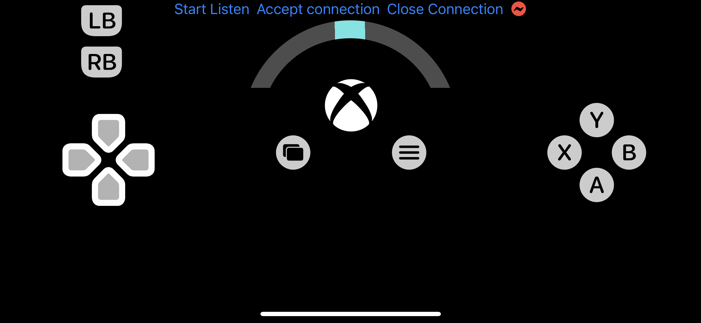

# Xpad v1.0
Use iOS devices as game controller for PC via usb-lighting cable.


## How to use

### Prequirments

- Clone this repository into your pc and update submodule.

  ```
  git clone https://github.com/JumpyzZ/Xpad.git
  cd /Xpad
  git init submodule
  git submodule update
  ```

- [iOS] Open /Xpad/XpadIOSClient/XpadIOSClient.xcworkspace using Xcode, connect your device and build XpadIOSClient on it.

- [PC] Install iTunes, inorder to install `usbmuxd`  service for providing TCP connection over USB pipe.

### When ready

1. Connect your device to your windows PC.

2. Run XpadIOSClient on your device, click "Start Listen".

   

3. Run PC client, create a virtual controller using vgamepad and send connect request to device.

   ```
   cd /Xpad/XpadPCClient
   python main.py
   ```

4. On XpadIOSClient, click "Accept Connection".

5. Have fun!


## Features

- This is a toy I built to play Forza Horizon 4, in order to take advantage of 3D-Touch ability of my iPhoneXS. So accoring to my preference, button is maped as below:

  ```
  Press left section -> Left Shoulder Button (Break)
  Press right section -> Right Shoulder Button (Gas)
  Steering -> Left Joystick X-axis (Steer)
  ```

- When run PC client for the first time, windows will ask you to give access to network connection, choose allow and re-run `main.py`

  

## Bugs

- iOS client will crash if cable is unplugged when connected and running.
- Must follow exact order 1-4 to connect iOS client to PC.
- When device is rotated, steer will not rotate, so don't do that.
- Not sure what will happen if device don't support 3D-Touch.

## Thanks to

- usbmuxd python client, work from Hector Martin (https://github.com/marcan)
- BlueSocket, work from Kitura (https://github.com/Kitura)
- Python api for virtual controller, work from Yann Bouteiller (https://github.com/yannbouteiller)

